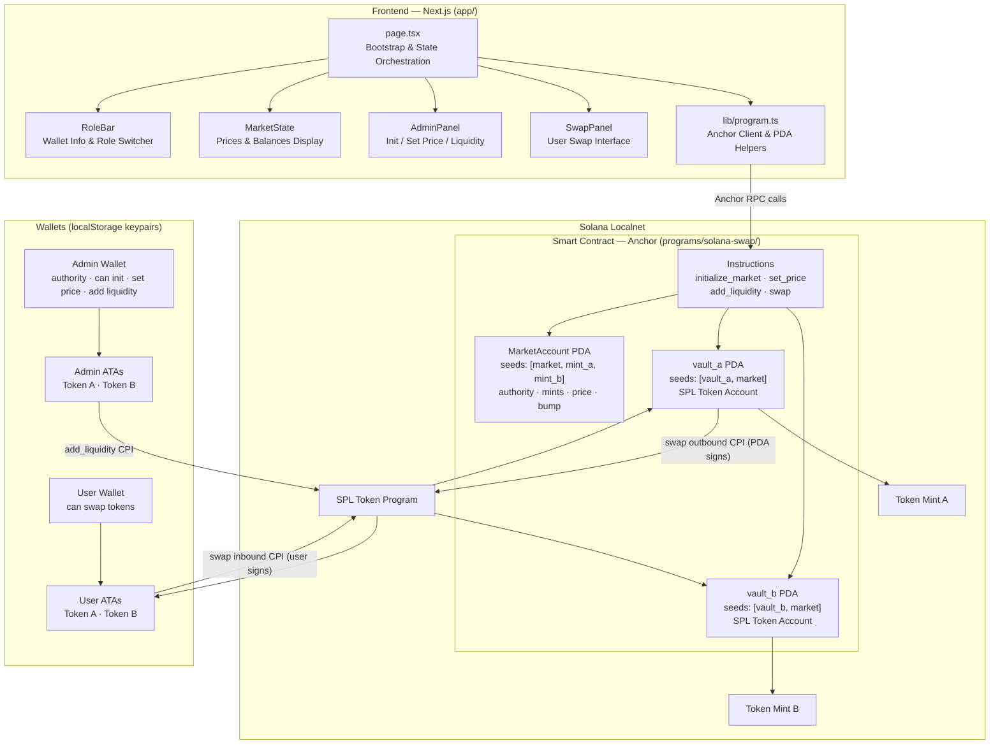

# Solana Swap

A fixed-price token swap program built on Solana using the Anchor framework, paired with a Next.js frontend. Designed as a hands-on learning project that covers the full stack of a DeFi protocol: on-chain Rust smart contract, TypeScript integration, and a minimal but functional UI.

---

## Watch the full Demo

- **Peter-Dubin_Rust-practice_Solana-swap**: https://drive.google.com/file/d/142wCzSJhjWKfSx2cDkus7Ei5s_gKu8nm/view?usp=sharing

## Architecture



---

## How It Works

The program is a **fixed-rate exchange** between two SPL tokens. An admin sets the price and funds the vaults; users then swap at that rate. All logic is atomic — both sides of a transfer either succeed or the transaction reverts.

### Exchange Rate Formula

Prices are stored as `u64` scaled by `10^6` to represent fractional rates in integer arithmetic:

| Human rate | Stored value |
|---|---|
| 1.0× | 1,000,000 |
| 2.5× | 2,500,000 |
| 0.4× | 400,000 |

**Example — Swap 100 Token A at 2.5× (both tokens have 6 decimals):**
```
amount_b = (100 × 2_500_000 × 10^6) / (10^6 × 10^6) = 250
```

---

## Modules

### Smart Contract — `programs/solana-swap/src/lib.rs`

#### State

**`MarketAccount`** — the single on-chain account that defines a market.

| Field | Type | Description |
|---|---|---|
| `authority` | `Pubkey` | Admin wallet; only this account can call `set_price` |
| `token_mint_a` | `Pubkey` | SPL mint address for Token A |
| `token_mint_b` | `Pubkey` | SPL mint address for Token B |
| `price` | `u64` | Exchange rate scaled by `10^6` |
| `decimals_a` | `u8` | Decimal precision of Token A |
| `decimals_b` | `u8` | Decimal precision of Token B |
| `bump` | `u8` | PDA canonical bump seed |

PDA seeds: `["market", token_mint_a, token_mint_b]`

Two SPL token vaults live alongside the market account, both owned by the market PDA:
- **vault_a** — seeds: `["vault_a", market_pda]`
- **vault_b** — seeds: `["vault_b", market_pda]`

Because the market PDA is the vault authority, the program can sign outbound transfers without any private key. This is the core trustless mechanism.

#### Instructions

**`initialize_market(price, decimals_a, decimals_b, bump)`**
Creates the `MarketAccount` and both token vaults in one transaction. Called once by the admin.

**`set_price(price)`**
Updates the exchange rate. Restricted to the market authority. Validates that `price > 0`.

**`add_liquidity(amount_a, amount_b)`**
Authority deposits tokens from their wallet into the vaults. Either amount can be zero to top up only one side.

**`swap(amount, a_to_b)`**
User swaps tokens at the current fixed price.
- `a_to_b = true`: user sends Token A → receives Token B
- `a_to_b = false`: user sends Token B → receives Token A

Each swap is two CPI calls to the SPL Token program — inbound (user signs) and outbound (PDA signs) — wrapped in a single atomic transaction.

#### Error Codes

| Error | When |
|---|---|
| `Unauthorized` | `set_price` called by non-authority |
| `PriceNotSet` | price is zero at swap time |
| `AmountOutTooSmall` | calculated output rounds to zero |
| `InvalidPriceForReverseSwap` | price is zero in B→A direction |
| `ZeroAmount` | input amount is zero |
| `CalculationOverflow` | arithmetic overflow in price formula |

---

### Frontend — `app/`

#### `app/src/app/page.tsx` — Bootstrap & Orchestration

Runs on load and does the full environment setup:
1. Load or generate persistent keypairs from `localStorage`
2. Connect to localnet RPC (`http://localhost:8899`)
3. Airdrop SOL to admin and user wallets if needed
4. Create or load token mints (also persisted to `localStorage`)
5. Create Associated Token Accounts for both wallets
6. Mint demo tokens if balances are low
7. Derive market and vault PDAs via `findProgramAddressSync`
8. Fetch on-chain market state and set UI to ready

Manages all shared state: market data, balances, transaction log, role, and ready status.

#### `app/src/components/RoleBar.tsx`

Role switcher (Admin / User dropdown), active wallet address (truncated), and SOL balance. Lets the user simulate both sides of the market in one browser tab.

#### `app/src/components/MarketState.tsx`

Read-only display of current exchange rate, vault balances, and the active wallet's token balances. Dims the UI if the market has not been initialized yet.

#### `app/src/components/AdminPanel.tsx`

Three-tab admin interface:
- **Initialize** — deploy the market with a starting price (default 2.5×)
- **Set Price** — update the exchange rate
- **Add Liquidity** — deposit Token A and/or Token B into the vaults

Controls are disabled appropriately based on market state.

#### `app/src/components/SwapPanel.tsx`

User-facing swap interface with direction toggle (A→B / B→A), amount input, live output preview, and a swap button. Disabled if the market is not ready or the amount is zero.

#### `app/src/lib/program.ts`

Anchor client setup and shared utilities:
- `getProgram(wallet)` — returns a configured Anchor `Program` instance
- `deriveMarketPda(mintA, mintB)` — derives market account PDA
- `deriveVaultPda(seed, market)` — derives vault_a or vault_b PDA
- Exports: `PROGRAM_ID`, `RPC_ENDPOINT`, `PRICE_DECIMAL_FACTOR`, `DECIMALS`, `SCALE`
- `MarketData` TypeScript interface matching the on-chain `MarketAccount`

---

### Tests — `tests/solana-swap.ts`

Four end-to-end test cases against localnet:

1. **Initialize market** — verify all `MarketAccount` fields are set correctly
2. **Set price** — verify price update is reflected on-chain
3. **Add liquidity** — verify vault balances increase and authority balances decrease
4. **Swap A→B** — swap 100 Token A at 2.5× rate, verify user receives 250 Token B

Test setup creates two funded keypairs, two SPL mints (6 decimals), and mints 1,000,000 of each token to each wallet.

---

## Tech Stack

| Layer | Technology |
|---|---|
| Smart contract | Rust, Anchor 0.31.1 |
| SPL integration | anchor-spl 0.31.1 |
| Frontend | Next.js 14, React 18, Tailwind CSS |
| Web3 client | @coral-xyz/anchor 0.31.1, @solana/web3.js 1.95.5 |
| Token operations | @solana/spl-token 0.4.13 |
| Tests | ts-mocha, Chai |
| Target network | Solana localnet |

---

## Getting Started

### Prerequisites

- [Rust](https://rustup.rs/) + `cargo`
- [Solana CLI](https://docs.solana.com/cli/install-solana-cli-tools)
- [Anchor CLI](https://www.anchor-lang.com/docs/installation) 0.31.x
- Node.js 18+

### Run locally

```bash
# 1. Start a local Solana validator
solana-test-validator

# 2. Build and deploy the program
anchor build
anchor deploy

# 3. Run the test suite
anchor test --skip-local-validator

# 4. Start the frontend
cd app
npm install
npm run dev
# Open http://localhost:3000
```

The UI auto-bootstraps — it creates wallets, mints, and token accounts on first load. Switch between Admin and User roles to walk through the full swap flow.

---

## Plans & Learning Notes

- [plans/solana-swap-requirements.md](plans/solana-swap-requirements.md) — full specification, price formulas, and test scenarios
- [plans/solana-swap-learnings.md](plans/solana-swap-learnings.md) — deep-dive on PDAs, vaults, the fixed-price model, common pitfalls, and demo walkthrough notes
- [plans/adding-minimal-ui.md](plans/adding-minimal-ui.md) — UI implementation notes
